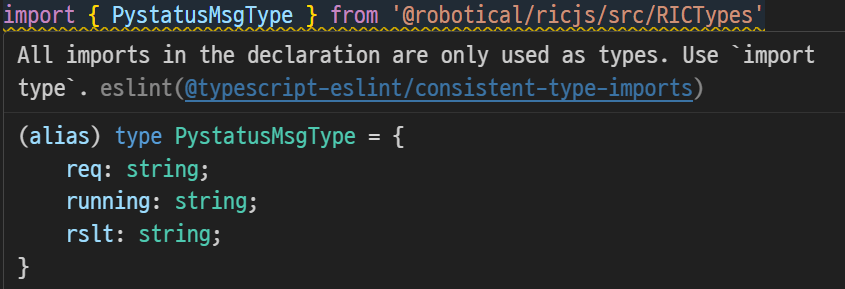
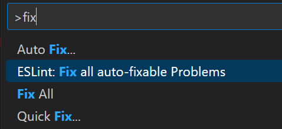

# HW PET TEMPLATE

This GitHub repository collects hardware control programs that are integrated with the AI Codiny service.

The subfolders in this repository contain source code for independent deployable web pages, each integrating with a specific hardware.

To add hardware to the AI Codiny service, it is recommended to copy and modify one of the subfolders.

## Hardware examples

The currently registered hardware includes the following:

- [very-basic-example](./very-basic-example/README.md) - An example containing the minimum basic implementation.

- [saeonAltinoLite-ble](./saeonAltinoLite-ble/README.md) - `알티노 라이트` 하드웨어 제어(한글 설명).
- [marty](./marty/README.md) - Code for controlling the `Marty` hardware.
- [exMarsCube](./exMarsCube/README.md) - Code for controlling the `exMarsCube` hardware.

> 가장 마지막으로 업데이트 된 하드웨어는 `알티노 라이트`입니다. 신규 프로젝트를 작성하는 경우 `알티노 라이트`를 복사하는 것을 권장합니다.

> The most recently updated hardware is the `Altino Light.` When creating a new project, it is recommended to replicate the `Altino Light.`

## Code Deployment

The code written by each company is deployed to the AI Codiny server by the AI Codiny administrator. If you wish to deploy, please send a deployment request email.

When deploying, the AI Codiny administrator executes the `_export.sh` command. Before sending the deployment request email, please execute `_export.sh` to ensure there are no issues.

## Development Guidelines

In general, we do not interfere with the source code of each company. It just needs to work.

However, it is recommended to run lint on the source code before committing.

```sh
cd main
pnpm lint
```

### eslint Rules Recommended

It is not mandatory, but please adhere to `eslint rules` to avoid potential bugs.

If you want to modify eslint rules, you can do so in the `main/.eslintrc.js` file.
Of course, you can also `disable` eslint rules.

```js
// file: main/.eslintrc.js

module.exports = {
  extends: ["custom/next"],
  // ...
  rules: {
    "no-lonely-if": "off",
    "no-empty": "off",

    // add your rules
  },
};
```

#### Dependency Cycle

A `dependency cycle error` should be fixed as it can lead to memory leaks.

The following code is an example of the dependency cycle issue. Two modules are importing each other.

```javascript
// file: RICNotificationsManager.ts
import { MartyConnector } from "./MartyConnector";
export class RICNotificationsManager {
  // ...
}
```

```javascript
// file: MartyConnector.ts
import { RICNotificationsManager } from "./RICNotificationsManager";
export class MartyConnector {
  // ...
}
```

If you have lint rules enabled in `vscode`, you will see the following error message.


Please fix it using other methods, such as using interfaces.

#### Type import



The above `eslint warning` can be fixed as follows.

```javascript
import type { PystatusMsgType } from "@robotical/ricjs/src/RICTypes";
```

When TypeScript is transpiled into JavaScript, type information is removed. Therefore, when importing only types, dependency-cycle issues do not occur. Thus, it is advisable to use import type when dealing exclusively with types.

In `VSCode`, you can easily address this using the `eslint fix all` command.



It is convenient to set up a shortcut key for this in VSCode.

### Use Code Formatter

We use `prettier` as our code formatter.

You can format the entire source code with the following command:

```sh
pnpm format
```

The configuration files are as follows. Each team can format according to their desired settings.

```
.prettierrc.js
.prettierrcignore
```

End.
